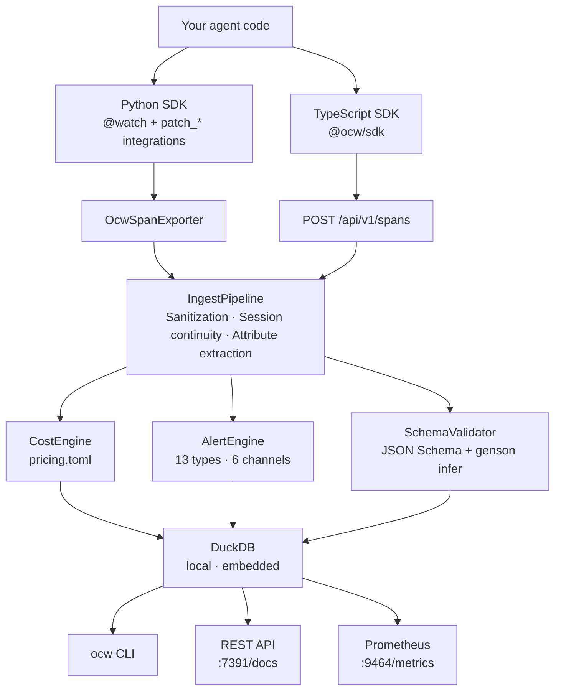

<div align="center">


# OpenClawWatch

**Local-first observability for autonomous AI agents.**

No cloud. No signup. No surprises.

[](https://github.com/Metabuilder-Labs/openclawwatch/actions/workflows/ci.yml)
[](https://pypi.org/project/openclawwatch/)
[](https://pypi.org/project/openclawwatch/)
[](LICENSE)
[](https://opentelemetry.io/docs/specs/semconv/gen-ai/)

```
pip install openclawwatch
ocw onboard
```

</div>

---

## The problem

Your agent sends emails while you sleep. It writes files, submits forms, calls APIs, spends your money. You find out what happened in the morning — if you're lucky.

Every observability tool out there was built for LLM developers building chat products. None of them were built for **agents with real-world consequences**.

`ocw` was.

---

## What it does

```
ocw status
```

```
● my-email-agent  active  (4m 23s)

  Cost today:     $0.0340 / $5.0000 limit
  Tokens:         12.4k in / 3.8k out
  Tool calls:     47  (2 failed)
  Active session: sess-a1b2c3

  send_email called (sensitive action: critical)
```

Or when everything is clean:

```
● my-email-agent  idle

  Cost today:     $0.0340 / $5.0000 limit
  Tokens:         12.4k in / 3.8k out
  Tool calls:     47
  Active session: sess-a1b2c3

  No active alerts
```

**Tracks cost in real time.** Every LLM call is priced as it happens — by agent, model, session, and tool. Budget alerts fire before you hit the limit, not after.

**Fires safety alerts the moment something happens.** `send_email`, `write_file`, `delete_record`, `submit_form` — configure any tool call as a sensitive action and get notified immediately via ntfy, Discord, Telegram, webhook, or all of the above.

**Detects behavioral drift.** Agents change silently — a prompt tweak, a model update, a dependency bump. `ocw` builds a statistical baseline from your agent's real behavior and alerts you when something deviates. No LLM required.

**Validates tool outputs.** Declare a JSON Schema for your tools or let `ocw` infer one automatically. Schema violations are caught the moment they occur — not ten steps later when your agent has already compounded the error.

**Runs entirely on your machine.** DuckDB. Local REST API. No cloud backend. No API key for `ocw` itself. Your telemetry data never leaves unless you explicitly configure it to.

---

## Quickstart

```bash
pip install openclawwatch
ocw onboard          # creates .ocw/config.toml, generates ingest secret
ocw doctor           # verify your setup
```

Instrument your agent:

```python
from ocw.sdk import watch
from ocw.sdk.integrations.anthropic import patch_anthropic

patch_anthropic()    # intercepts all Anthropic API calls automatically

@watch(agent_id="my-agent")
def run(task: str) -> str:
    # your agent code here — nothing else to change
    ...
```

Watch it live:

```bash
ocw status           # current state, cost, active alerts
ocw traces           # full span history with waterfall view
ocw cost --since 7d  # cost breakdown by agent, model, day
ocw alerts           # everything that fired while you were away
```

---

## Framework support

`ocw` is OTel-native. Any framework that emits OpenTelemetry spans works automatically — point its OTLP exporter at `ocw serve` and you're done. For everything else, one-line patches exist.

**Python — provider patches** (intercept at the API level, framework-agnostic):

```python
from ocw.sdk.integrations.anthropic import patch_anthropic   # Anthropic — Messages.create + streaming
from ocw.sdk.integrations.openai    import patch_openai      # OpenAI — chat completions
from ocw.sdk.integrations.gemini    import patch_gemini      # Google Gemini — GenerativeModel
from ocw.sdk.integrations.bedrock   import patch_bedrock     # AWS Bedrock — boto3 invoke_model/invoke_agent
```

OpenAI-compatible providers (Groq, Together, Fireworks, xAI, Azure OpenAI) work via `patch_openai(base_url=...)` — no separate patches needed.

**Python — framework patches** (instrument the framework's own tool and LLM abstractions):

```python
from ocw.sdk.integrations.langchain         import patch_langchain        # BaseLLM + BaseTool
from ocw.sdk.integrations.langgraph         import patch_langgraph        # CompiledGraph
from ocw.sdk.integrations.crewai            import patch_crewai           # Task + Agent
from ocw.sdk.integrations.autogen           import patch_autogen          # ConversableAgent
from ocw.sdk.integrations.llamaindex        import patch_llamaindex       # Native OTel wrapper
from ocw.sdk.integrations.openai_agents_sdk import patch_openai_agents   # Native OTel wrapper
from ocw.sdk.integrations.nemoclaw          import watch_nemoclaw         # NemoClaw Gateway observer
```

**Zero-code via OTLP** — point any of these frameworks' built-in OTel exporter at `ocw serve`, no integration code required:

| Framework | OTel support |
|---|---|
| LlamaIndex | `opentelemetry-instrumentation-llama-index` |
| OpenAI Agents SDK | Built-in |
| Google ADK | Built-in |
| Strands Agent SDK (AWS) | Built-in |
| Haystack | Built-in |
| Pydantic AI | Built-in |
| Semantic Kernel | Built-in |

**TypeScript / Node.js** — `@ocw/sdk` provides `OcwClient` and `SpanBuilder` for sending spans to `ocw serve` from any TypeScript agent:

```typescript
import { OcwClient, SpanBuilder } from "@ocw/sdk";

const client = new OcwClient({
  baseUrl:      "http://127.0.0.1:7391",
  ingestSecret: process.env.OCW_INGEST_SECRET ?? "",
});

const span = new SpanBuilder("invoke_agent")
  .agentId("my-ts-agent")
  .model("gpt-4o-mini")
  .provider("openai")
  .inputTokens(450)
  .outputTokens(120)
  .build();

await client.send([span]);
```

---

## Alert channels

Configure where alerts go. Multiple channels work simultaneously.

```toml
# .ocw/config.toml

[[alerts.channels]]
type = "ntfy"
topic = "my-agent-alerts"   # push to your phone, free, no account required

[[alerts.channels]]
type = "discord"
webhook_url = "https://discord.com/api/webhooks/..."

[[alerts.channels]]
type = "webhook"
url = "https://your-endpoint.com/alerts"
```

Alert types: `sensitive_action` · `cost_budget_daily` · `cost_budget_session` · `retry_loop` · `token_anomaly` · `schema_violation` · `drift_detected` · `failure_rate` · `network_egress_blocked` · `filesystem_access_denied` · `syscall_denied` · `inference_rerouted`

---

## NemoClaw support

Running OpenClaw inside [NVIDIA NemoClaw](https://github.com/NVIDIA/NemoClaw)? `ocw` connects to the OpenShell Gateway WebSocket and turns every sandbox event — blocked network requests, filesystem denials, inference reroutes — into a first-class alert.

```python
from ocw.sdk.integrations.nemoclaw import watch_nemoclaw

observer = watch_nemoclaw()
asyncio.create_task(observer.connect())  # non-blocking, runs alongside your agent
```

This is the observability layer that NemoClaw doesn't ship with.

---

## Export and integrate

```bash
# Forward spans to Grafana, Datadog, or any OTel backend
ocw export --format otlp

# Export traces for openevals / agentevals trajectory evaluation
ocw export --format openevals --output traces.json

# Raw data
ocw export --format json
ocw export --format csv
```

Prometheus metrics are always available at `:9464/metrics` when `ocw serve` is running.

---

## Architecture



Spans from Python land via the in-process OTel exporter. Spans from TypeScript (or any external process) arrive via HTTP. Both paths converge at `IngestPipeline`. Everything downstream is identical.

---

## Configuration

```toml
# .ocw/config.toml — generated by ocw onboard

[agents.my-email-agent]
description = "Personal email management agent"

  [agents.my-email-agent.budget]
  daily_usd   = 5.00
  session_usd = 1.00

  [[agents.my-email-agent.sensitive_actions]]
  name     = "send_email"
  severity = "critical"

  [[agents.my-email-agent.sensitive_actions]]
  name     = "delete_file"
  severity = "critical"

  [agents.my-email-agent.drift]
  enabled           = true
  baseline_sessions = 10
  token_threshold   = 2.0   # Z-score

[capture]
prompts      = false   # off by default — your data stays yours
completions  = false
tool_outputs = false

[storage]
path           = "~/.ocw/telemetry.duckdb"
retention_days = 90
```

Run `ocw doctor` to verify your configuration at any time.

---

## CLI reference

```
ocw onboard          Guided setup wizard (creates config, generates ingest secret)
ocw doctor           Health check — config, DB, security, channel validation
ocw status           Current agent state, cost, token counts, active alerts
ocw traces           Trace listing with span waterfall view
ocw cost             Cost breakdown by agent / model / day / tool
ocw alerts           Alert history with filtering by type and severity
ocw drift            Drift report: baseline vs latest session Z-scores
ocw tools            Tool call history with error rates
ocw export           Export to json / csv / otlp / openevals
ocw serve            Local REST API + Prometheus metrics endpoint
```

---

## Why not LangSmith / Langfuse / Datadog?

Those tools were built for LLM developers — tracing API calls, comparing prompts, running evals on chat outputs. They're excellent at that. `ocw` was built for a different problem: **autonomous agents running unsupervised with real-world consequences**.

| | `ocw` | LangSmith | Langfuse | Datadog LLM Obs |
|---|---|---|---|---|
| Real-time sensitive action alerts | ✅ | ❌ | ❌ | ❌ |
| Behavioral drift detection | ✅ | ❌ | ❌ | ❌ |
| Local-first, no cloud required | ✅ | ❌ | self-host only | ❌ |
| OTel GenAI SemConv native | ✅ | partial | partial | partial |
| NemoClaw sandbox events | ✅ | ❌ | ❌ | ❌ |
| Works with any agent/framework | ✅ | LangChain-first | partial | ❌ |
| Free, MIT licensed | ✅ | freemium | freemium | paid |

---

## Contributing

```bash
git clone https://github.com/Metabuilder-Labs/openclawwatch
cd openclawwatch
pip install -e ".[dev]"

pytest tests/unit/ tests/synthetic/ tests/agents/ tests/integration/
ruff check ocw/
mypy ocw/
```

223 tests. 2.3 seconds. All green.

See [AGENTS.md](AGENTS.md) for codebase conventions and how AI coding agents should work in this repo.

PRs welcome. If you're adding a framework integration, open an issue first so we can align on the approach.

---

## Roadmap

- [ ] `ocw serve` background daemon (launchd / systemd)
- [ ] Vercel AI SDK integration (TypeScript)
- [ ] Azure AI Agent Service integration
- [ ] TypeScript framework patches (LangChain JS, OpenAI Agents SDK)
- [ ] `ocw replay` — replay captured sessions against new model versions
- [ ] LiteLLM provider patch
- [ ] Mastra integration (TypeScript)
- [ ] Web UI for `ocw serve`

---

<div align="center">

**[opencla.watch](https://opencla.watch)** · [PyPI](https://pypi.org/project/openclawwatch/) · [npm](https://www.npmjs.com/package/@ocw/sdk)

MIT License · Built by [Metabuilder Labs](https://github.com/Metabuilder-Labs)

</div>