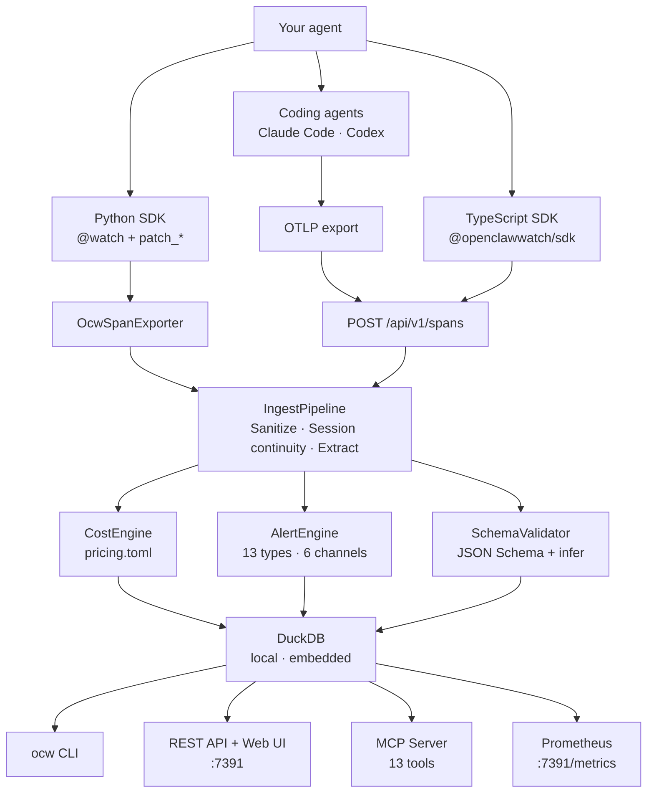

<div align="center">


# OpenClawWatch

**Local-first observability for autonomous AI agents.**

No cloud. No signup. No surprises.

[](https://github.com/Metabuilder-Labs/openclawwatch/actions/workflows/ci.yml)
[](https://pypi.org/project/openclawwatch/)
[](https://pypi.org/project/openclawwatch/)
[](https://www.npmjs.com/package/@openclawwatch/sdk)
[](LICENSE)
[](https://opentelemetry.io/docs/specs/semconv/gen-ai/)

```
pip install openclawwatch
```

</div>

---

Your agent sends emails, writes files, calls APIs, and spends your money — all while you're away. Most observability tools were built for LLM developers building chat products. `ocw` was built for **agents with real-world consequences**.

---

## What you get

**Real-time cost tracking.** Every LLM call is priced as it happens — by agent, model, session, and tool. Budget alerts fire before you hit the limit, not after.

**Safety alerts.** Configure any tool call as a sensitive action (`send_email`, `delete_file`, `submit_form`) and get notified instantly via ntfy, Discord, Telegram, webhook, or stdout.

**Behavioral drift detection.** `ocw` builds a statistical baseline from your agent's real behavior and alerts when something deviates — a prompt tweak, a model update, a dependency bump. No LLM required.

**Tool output validation.** Declare a JSON Schema for your tools or let `ocw` infer one automatically. Schema violations are caught the moment they occur.

**100% local.** DuckDB. Local REST API. No cloud backend. No API key for `ocw` itself. Your telemetry never leaves your machine unless you explicitly export it.

---

## Get started

`ocw` works four ways. Pick the one that fits.

### Coding agents — zero code

For **Claude Code**, **Codex**, and any agent that already emits OpenTelemetry. No SDK, no code changes.

```bash
pip install "openclawwatch[mcp]"
ocw onboard --claude-code    # or: ocw onboard --codex
# Restart your coding agent
```

Every session, API call, tool use, and error is now a tracked span with cost and alert evaluation. The MCP server gives your coding agent 13 tools to query its own telemetry mid-session — just ask "how much have I spent today?" or "are there any active alerts?"

[Full Claude Code & Codex setup →](#claude-code--coding-agents)

### Python SDK

For any Python agent — Anthropic, OpenAI, Gemini, Bedrock, LangChain, CrewAI, and [10+ more](#supported-frameworks).

```bash
pip install openclawwatch
ocw onboard
```

```python
from ocw.sdk import watch
from ocw.sdk.integrations.anthropic import patch_anthropic

patch_anthropic()    # auto-intercepts all Anthropic API calls

@watch(agent_id="my-agent")
def run(task: str) -> str:
    # your agent code — nothing else to change
    ...
```

One-line patches exist for every major provider and framework. [See all integrations →](#supported-frameworks)

### TypeScript SDK

For any Node.js / TypeScript agent. Sends spans to `ocw serve` over HTTP.

```bash
npm install @openclawwatch/sdk
```

```typescript
import { OcwClient, SpanBuilder } from "@openclawwatch/sdk";

const client = new OcwClient({
  baseUrl:      "http://127.0.0.1:7391",
  ingestSecret: process.env.OCW_INGEST_SECRET ?? "",
});

const span = new SpanBuilder("invoke_agent")
  .agentId("my-ts-agent")
  .model("gpt-4o-mini")
  .provider("openai")
  .inputTokens(450)
  .outputTokens(120)
  .build();

await client.send([span]);
```

### Any OTel-compatible agent

Already emitting OpenTelemetry? Point your OTLP exporter at `ocw serve` — no SDK needed:

```bash
ocw serve &
export OTEL_EXPORTER_OTLP_ENDPOINT=http://127.0.0.1:7391
# run your agent as usual
```

| Framework | OTel support |
|---|---|
| **Claude Code** | Built-in — `ocw onboard --claude-code` |
| **OpenClaw** | Built-in (`diagnostics-otel` plugin) — [setup guide](docs/openclaw.md) |
| LlamaIndex | `opentelemetry-instrumentation-llama-index` |
| OpenAI Agents SDK | Built-in |
| Google ADK | Built-in |
| Strands Agent SDK (AWS) | Built-in |
| Haystack | Built-in |
| Pydantic AI | Built-in |
| Semantic Kernel | Built-in |

---

## CLI

```
ocw status
```

```
● my-email-agent   completed   (2m 14s)

  Cost today:     $0.0340 / $5.0000 limit
  Tokens:         12.4k in / 3.8k out
  Tool calls:     47
  Active session: sess-a1b2c3

  send_email called (sensitive action: critical)
```

https://github.com/user-attachments/assets/b94d13f6-1432-40d4-b093-6958d74f0e65

```bash
ocw status           # current state, cost, active alerts
ocw traces           # full span history with waterfall view
ocw cost --since 7d  # cost breakdown by agent, model, day
ocw alerts           # everything that fired while you were away
ocw budget           # view and set daily/session cost limits
ocw drift            # behavioral drift Z-scores vs baseline
ocw tools            # tool call history with error rates
ocw serve            # start the web UI + REST API
```

All commands support `--json` for machine-readable output. Full reference: [docs/cli-reference.md](docs/cli-reference.md)

---

## Web UI

`ocw serve` starts a local dashboard at `http://127.0.0.1:7391/`.

https://github.com/user-attachments/assets/ff09caec-3487-4542-8628-d62b7d92591f

- **Status** — agent overview with cost, tokens, tool calls, and active alerts
- **Traces** — trace list with span waterfall visualization
- **Cost** — breakdown by agent, model, day, or tool
- **Alerts** — alert history with severity filtering
- **Budget** — view and edit daily/session cost limits per agent
- **Drift** — behavioral drift report with Z-score analysis

No signup, no cloud — runs entirely on your machine.

---

## ocw vs LangSmith vs Langfuse

LangSmith and Langfuse are excellent for tracing LLM API calls and running evals on chat outputs. `ocw` solves a different problem: **autonomous agents running unsupervised with real-world consequences**.

| | `ocw` | LangSmith | Langfuse | Datadog LLM Obs |
|---|---|---|---|---|
| Signup required | No | Yes | Yes | Yes |
| Data leaves your machine | No | Yes | Cloud only | Yes |
| Real-time sensitive action alerts | Yes | — | — | — |
| Behavioral drift detection | Yes | — | — | — |
| Local-first, no cloud required | Yes | — | Self-host only | — |
| OTel GenAI SemConv native | Yes | Partial | Partial | Partial |
| NemoClaw sandbox events | Yes | — | — | — |
| Works with any agent/framework | Yes | LangChain-first | Partial | — |
| Free, MIT licensed | Yes | Freemium | Freemium | Paid |

---

## Claude Code + coding agents

### Claude Code

Monitor every Claude Code session — costs, tool calls, API requests, errors — with two commands:

```bash
pip install "openclawwatch[mcp]"
ocw onboard --claude-code
# Restart Claude Code
```

`ocw onboard --claude-code` does everything in one shot:

- Creates a shared config at `~/.config/ocw/config.toml`
- Writes OTLP exporter vars to `~/.claude/settings.json`
- Tags this project via `OTEL_RESOURCE_ATTRIBUTES` in `.claude/settings.json`
- Registers the MCP server globally (`claude mcp add --scope user ocw -- ocw mcp`)
- Installs a background daemon (launchd on macOS, systemd on Linux)

**Adding more projects** — run once per project directory:

```bash
cd /path/to/other-project
ocw onboard --claude-code   # tags this project, no reinstall needed
# Restart Claude Code
```

Each project gets its own agent ID (`claude-code-<repo-name>`), all sharing one daemon and one ingest secret.

```bash
ocw status --agent claude-code-<project>   # check it's working
```

### MCP server

Onboarding registers an MCP server, giving your coding agent 13 tools to query its own observability data mid-session:

| Tool | What it does |
|---|---|
| `get_status` | Current agent state — tokens, cost, active alerts |
| `get_budget_headroom` | Budget limit vs spend |
| `list_active_sessions` | All running sessions across agents |
| `list_agents` | All known agents with lifetime cost |
| `get_cost_summary` | Cost breakdown by day / agent / model |
| `list_alerts` | Alert history with severity filtering |
| `list_traces` | Recent traces with cost and duration |
| `get_trace` | Full span waterfall for a trace |
| `get_tool_stats` | Tool call counts and average duration |
| `get_drift_report` | Drift baseline vs latest session |
| `acknowledge_alert` | Mark an alert as acknowledged |
| `setup_project` | Configure a project for OCW telemetry |
| `open_dashboard` | Open the web UI (starts `ocw serve` if needed) |

The MCP server opens DuckDB read-only — no lock conflicts with `ocw serve`.

Ask in natural language:

```
"How much have I spent today?"           → get_status / get_cost_summary
"Show me my recent traces"               → list_traces
"Are there any active alerts?"           → list_alerts
"Which model is costing me the most?"    → get_cost_summary (group_by=model)
"Is my agent behaving differently?"      → get_drift_report
"Open the dashboard"                     → open_dashboard
```

### Codex

```bash
pip install "openclawwatch[mcp]"
ocw onboard --codex
# Restart Codex
```

`ocw onboard --codex` writes an `[otel]` block and `[mcp_servers.ocw]` to `~/.codex/config.toml`, tags the project as `codex-<repo-name>`, and installs the background daemon.

Unlike Claude Code, Codex has no per-project settings file — the `service.name` tag lives in `~/.codex/config.toml`. If you have multiple projects, run `ocw onboard --codex --force` from each directory to retag.

The same 13 MCP tools are available to Codex after restart.

### Uninstalling

```bash
ocw uninstall --yes    # removes daemon, MCP, config, data, env vars
pip uninstall openclawwatch -y
```

Full Claude Code integration guide: [docs/claude-code-integration.md](docs/claude-code-integration.md)

---

## Supported frameworks

### Python — provider patches

Intercept at the API level. Framework-agnostic.

```python
from ocw.sdk.integrations.anthropic import patch_anthropic   # Anthropic
from ocw.sdk.integrations.openai    import patch_openai      # OpenAI
from ocw.sdk.integrations.gemini    import patch_gemini      # Google Gemini
from ocw.sdk.integrations.bedrock   import patch_bedrock     # AWS Bedrock
from ocw.sdk.integrations.litellm   import patch_litellm     # LiteLLM (100+ providers)
```

`patch_litellm()` covers all providers LiteLLM routes to (OpenAI, Anthropic, Bedrock, Vertex, Cohere, Mistral, Ollama, etc.). If you use LiteLLM, you don't need individual patches.

OpenAI-compatible providers (Groq, Together, Fireworks, xAI, Azure OpenAI) work via `patch_openai(base_url=...)`.

### Python — framework patches

Instrument the framework's own abstractions:

```python
from ocw.sdk.integrations.langchain         import patch_langchain        # BaseLLM + BaseTool
from ocw.sdk.integrations.langgraph         import patch_langgraph        # CompiledGraph
from ocw.sdk.integrations.crewai            import patch_crewai           # Task + Agent
from ocw.sdk.integrations.autogen           import patch_autogen          # ConversableAgent
from ocw.sdk.integrations.llamaindex        import patch_llamaindex       # Native OTel
from ocw.sdk.integrations.openai_agents_sdk import patch_openai_agents    # Native OTel
from ocw.sdk.integrations.nemoclaw          import watch_nemoclaw         # NemoClaw Gateway
```

Full framework support guide: [docs/framework-support.md](docs/framework-support.md)

---

## Alert channels

Configure where alerts go. Multiple channels work simultaneously.

```toml
# .ocw/config.toml

[[alerts.channels]]
type = "ntfy"
topic = "my-agent-alerts"   # push to your phone, free, no account

[[alerts.channels]]
type = "discord"
webhook_url = "https://discord.com/api/webhooks/..."

[[alerts.channels]]
type = "webhook"
url = "https://your-endpoint.com/alerts"
```

Alert types: `sensitive_action` · `cost_budget_daily` · `cost_budget_session` · `retry_loop` · `token_anomaly` · `schema_violation` · `drift_detected` · `failure_rate` · `network_egress_blocked` · `filesystem_access_denied` · `syscall_denied` · `inference_rerouted`

Full alert reference: [docs/alerts.md](docs/alerts.md)

---

## NemoClaw support

Running agents inside [NVIDIA NemoClaw](https://github.com/NVIDIA/NemoClaw)? `ocw` connects to the OpenShell Gateway WebSocket and turns sandbox events — blocked network requests, filesystem denials, inference reroutes — into alerts.

```python
from ocw.sdk.integrations.nemoclaw import watch_nemoclaw

observer = watch_nemoclaw()
asyncio.create_task(observer.connect())
```

Full event table and configuration: [docs/nemoclaw-integration.md](docs/nemoclaw-integration.md)

---

## Export and integrate

```bash
ocw export --format otlp       # forward to Grafana, Datadog, any OTel backend
ocw export --format openevals  # openevals / agentevals trajectory evaluation
ocw export --format json       # NDJSON
ocw export --format csv
```

Prometheus metrics at `http://127.0.0.1:7391/metrics` when `ocw serve` is running.

Full export guide: [docs/export.md](docs/export.md)

---

## Architecture



Full architecture deep-dive: [docs/architecture.md](docs/architecture.md)

---

## Configuration

```toml
# .ocw/config.toml — generated by ocw onboard

[defaults.budget]
daily_usd = 10.00

[agents.my-email-agent]
description = "Personal email management agent"

  [agents.my-email-agent.budget]
  daily_usd   = 5.00
  session_usd = 1.00

  [[agents.my-email-agent.sensitive_actions]]
  name     = "send_email"
  severity = "critical"

  [agents.my-email-agent.drift]
  enabled           = true
  baseline_sessions = 10
  token_threshold   = 2.0

[capture]
prompts      = false
completions  = false
tool_outputs = false

[storage]
path           = "~/.ocw/telemetry.duckdb"
retention_days = 90
```

Budget limits merge per-field: each agent inherits defaults unless overridden. Set via CLI (`ocw budget --daily 10`), API, or web UI. Run `ocw doctor` to verify.

Full configuration reference: [docs/configuration.md](docs/configuration.md)

---

## Examples

The [`examples/`](examples/) directory has runnable agents for every integration:

- **Single provider** — Anthropic, OpenAI, Gemini, Bedrock, OpenAI Agents SDK
- **Single framework** — LangChain, LangGraph, CrewAI, AutoGen, LlamaIndex
- **Multi-integration** — provider router, CrewAI + LangChain, RAG with fallback
- **Alerts and drift** — sensitive action alerts, budget breach, drift detection (no API keys needed)

```bash
python examples/single_provider/anthropic_agent.py
python examples/alerts_and_drift/drift_demo.py     # no API key needed
```

See [`examples/README.md`](examples/README.md) for the full list.

---

## Contributing

```bash
git clone https://github.com/Metabuilder-Labs/openclawwatch
cd openclawwatch
pip install -e ".[dev,mcp]"

pytest tests/unit/ tests/synthetic/ tests/agents/ tests/integration/
ruff check ocw/
mypy ocw/
```

See [AGENTS.md](AGENTS.md) for codebase conventions. PRs welcome — if you're adding a framework integration, open an issue first.

---

## Roadmap

**Shipped:**

- [x] `ocw serve` background daemon (launchd / systemd)
- [x] Web UI with auto-polling (status, traces, cost, alerts, budget, drift)
- [x] LiteLLM provider patch (100+ providers)
- [x] `ocw stop` and `ocw uninstall`
- [x] Claude Code integration (`ocw onboard --claude-code`)
- [x] Codex integration (`ocw onboard --codex`)
- [x] OpenClaw integration (zero-code via `diagnostics-otel` plugin)
- [x] NemoClaw sandbox observer (WebSocket gateway events)
- [x] OTLP log-to-span pipeline (Claude Code log events)
- [x] `ocw budget` CLI, API, and web UI
- [x] `ocw drift` with Z-score reporting
- [x] Full pipeline wiring (alerts, schema, drift in `ocw serve`)
- [x] MCP server — 13 tools for Claude Code

**Up next:**

- [ ] `ocw watch` — live tail mode for spans
- [ ] `ocw replay` — replay captured sessions against new model versions
- [ ] TypeScript framework patches (LangChain JS, OpenAI Agents SDK)
- [ ] Vercel AI SDK integration (TypeScript)
- [ ] Mastra integration (TypeScript)
- [ ] Azure AI Agent Service integration
- [ ] Docker image
- [ ] GitHub Actions for CI drift/cost checks

---

<div align="center">

**[opencla.watch](https://opencla.watch)** · [PyPI](https://pypi.org/project/openclawwatch/) · [npm](https://www.npmjs.com/package/@openclawwatch/sdk)

MIT License · Built by [Metabuilder Labs](https://github.com/Metabuilder-Labs)

</div>
