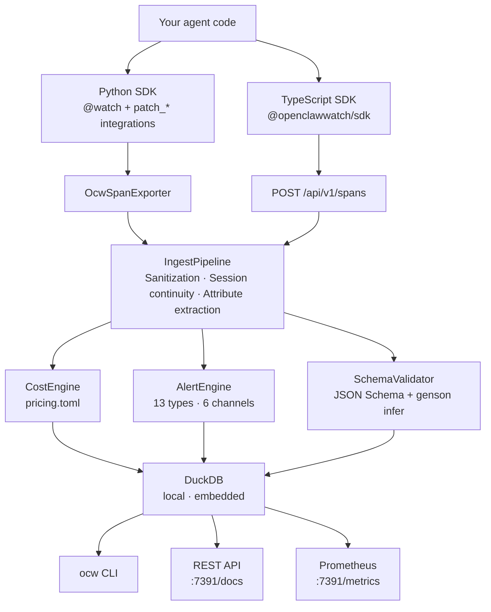

<div align="center">


# OpenClawWatch

**Local-first observability for autonomous AI agents.**

No cloud. No signup. No surprises.

[](https://github.com/Metabuilder-Labs/openclawwatch/actions/workflows/ci.yml)
[](https://pypi.org/project/openclawwatch/)
[](https://pypi.org/project/openclawwatch/)
[](LICENSE)
[](https://opentelemetry.io/docs/specs/semconv/gen-ai/)

```
pip install openclawwatch
ocw onboard
```

</div>

---

## The problem

Your agent sends emails while you sleep. It writes files, submits forms, calls APIs, spends your money. You find out what happened in the morning — if you're lucky.

Most observability tools out there were built for LLM developers building chat products. None of them were built for **agents with real-world consequences**.

`ocw` is.

**Works with Claude Code out of the box** — one command to start monitoring your Claude Code sessions, costs, and tool usage:

```bash
ocw onboard --claude-code
```

---

## What it does

```
ocw status
```

```
● $ ocw status                                       
  anthropic-tool-agent   completed   (0m 2s)

  Cost today:     $0.0018 / $10.0000 limit
  Tokens:         1.5k in / 151 out
  Tool calls:     2
  Active session: 65b7071c-2433-4fc2-a3d9-5b391c0bec66

  No active alerts

 litellm-multi-provider   completed   (0m 4s)

  Cost today:     $0.000199 / $10.0000 limit
  Tokens:         44 in / 68 out
  Tool calls:     0
  Active session: c9585dcf-6bfc-427b-9a27-c9db21f56db8

  send_email called (sensitive action: critical)
```

Or when everything is clean:

```
● my-email-agent  idle

  Cost today:     $0.0340 / $5.0000 limit
  Tokens:         12.4k in / 3.8k out
  Tool calls:     47
  Active session: sess-a1b2c3

  No active alerts
```

**Tracks cost in real time.** Every LLM call is priced as it happens — by agent, model, session, and tool. Budget alerts fire before you hit the limit, not after.

**Fires safety alerts the moment something happens.** `send_email`, `write_file`, `delete_record`, `submit_form` — configure any tool call as a sensitive action and get notified immediately via ntfy, Discord, Telegram, webhook, or all of the above.

**Detects behavioral drift.** Agents change silently — a prompt tweak, a model update, a dependency bump. `ocw` builds a statistical baseline from your agent's real behavior and alerts you when something deviates. No LLM required.

**Validates tool outputs.** Declare a JSON Schema for your tools or let `ocw` infer one automatically. Schema violations are caught the moment they occur — not ten steps later when your agent has already compounded the error.

**Runs entirely on your machine.** DuckDB. Local REST API. No cloud backend. No API key for `ocw` itself. Your telemetry data never leaves unless you explicitly configure it to.

---

## Quickstart

```bash
pip install openclawwatch
ocw onboard          # creates .ocw/config.toml, generates ingest secret
ocw doctor           # verify your setup
```

Instrument your agent:

```python
from ocw.sdk import watch
from ocw.sdk.integrations.anthropic import patch_anthropic

patch_anthropic()    # intercepts all Anthropic API calls automatically

@watch(agent_id="my-agent")
def run(task: str) -> str:
    # your agent code here — nothing else to change
    ...
```

**Try it with the included toy agent** (requires `ANTHROPIC_API_KEY`):

```bash
python tests/toy_agent/toy_agent.py    # makes one LLM call, creates a session
ocw status                              # see cost, tokens, session info
ocw traces                              # see the trace with span waterfall
ocw cost                                # cost breakdown by model
```

Watch it live:

https://github.com/user-attachments/assets/b94d13f6-1432-40d4-b093-6958d74f0e65

```bash
ocw status           # current state, cost, active alerts
ocw traces           # full span history with waterfall view
ocw cost --since 7d  # cost breakdown by agent, model, day
ocw alerts           # everything that fired while you were away
ocw budget           # view and set daily/session cost limits
ocw drift            # behavioral drift Z-scores vs baseline
ocw serve            # open http://127.0.0.1:7391/ for the web UI
```

## Web UI

`ocw serve` includes a local web dashboard at `http://127.0.0.1:7391/`.

https://github.com/user-attachments/assets/ff09caec-3487-4542-8628-d62b7d92591f

- **Status** — agent overview with cost, tokens, tool calls, and active alerts
- **Traces** — trace list with span waterfall visualization
- **Cost** — breakdown by agent, model, day, or tool
- **Alerts** — alert history with severity filtering
- **Budget** — view and edit daily/session cost limits per agent, with inherited defaults
- **Drift** — behavioral drift report with Z-score analysis

No signup, no cloud — runs entirely on your machine.

<!-- Screenshots: add after taking them manually


-->

---

## Claude Code integration

Monitor every Claude Code session — costs, tool calls, API requests, errors — with two commands:

```bash
pip install "openclawwatch[mcp]"
ocw onboard --claude-code
# Restart Claude Code, then:
ocw status --agent claude-code-<project>
```

`ocw onboard --claude-code` does everything in one shot:
- Creates a shared config at `~/.config/ocw/config.toml` (one config for all your projects)
- Writes OTLP exporter vars to `~/.claude/settings.json` so Claude Code sends telemetry automatically
- Tags this project's sessions by writing `OTEL_RESOURCE_ATTRIBUTES=service.name=claude-code-<project>` to `.claude/settings.json`
- Registers the MCP server globally (`claude mcp add --scope user ocw -- ocw mcp`)
- Installs a background daemon (launchd on macOS, systemd on Linux) to keep `ocw serve` alive across restarts
- Adds Docker harness-compatible OTLP env vars to `~/.zshrc`

**Claude Code must be restarted** after running `ocw onboard --claude-code` for the new `settings.json` env vars to take effect.

**Adding a second (or third) project** — run once per project directory, no reinstall needed:

```bash
cd /path/to/other-project
ocw onboard --claude-code   # adds agent to shared config, tags this project
# Restart Claude Code
```

Each project gets its own agent ID (`claude-code-<repo-name>`), all sharing one running server and one ingest secret. Running `ocw onboard --claude-code` in a new project never rotates the secret or breaks other projects.

Claude Code emits OTLP log events which `ocw serve` converts into spans — every API request, tool result, tool decision, and error becomes a first-class span with cost tracking, alert evaluation, and drift detection. Works in both interactive and autonomous (headless) mode.

### MCP server

The MCP server is included in the `[mcp]` extra and registered automatically by `ocw onboard --claude-code`. It gives Claude Code direct access to your observability data inside the session itself. After restarting Claude Code you have 13 tools available in every session:

| Tool | What it does |
|---|---|
| `get_status` | Current agent state — tokens, cost, active alerts |
| `get_budget_headroom` | Budget limit vs spend for an agent |
| `list_active_sessions` | All running sessions across agents |
| `list_agents` | All known agents with lifetime cost |
| `get_cost_summary` | Cost breakdown by day / agent / model |
| `list_alerts` | Alert history with severity and unread filtering |
| `list_traces` | Recent traces with cost and duration |
| `get_trace` | Full span waterfall for a single trace |
| `get_tool_stats` | Tool call counts and average duration |
| `get_drift_report` | Behavioral drift baseline vs latest session |
| `acknowledge_alert` | Mark an alert as acknowledged |
| `setup_project` | Configure a project to send telemetry to OCW |
| `open_dashboard` | Open the web UI — starts `ocw serve` on demand if needed |

The MCP server opens the DuckDB file read-only — no lock conflicts with `ocw serve` if both are running. The single write operation (`acknowledge_alert`) opens a short-lived read-write connection only for its UPDATE.

**Per-project telemetry tagging** — after installing the MCP server globally, ask Claude Code to set up each project:

> "Set up OCW for this project"

Claude calls `setup_project`, which writes `.claude/settings.json` with `OTEL_RESOURCE_ATTRIBUTES=service.name=<project>` so spans from that project are tagged with the right agent ID.

### Uninstalling

```bash
# Remove all OCW data, config, daemon, MCP registration, and env vars from every onboarded project:
ocw uninstall --yes

# Then remove the package itself (ocw uninstall intentionally skips this):
pip uninstall openclawwatch -y
```

`ocw uninstall` cleans up everything set by `ocw onboard --claude-code`:
- Stops and removes the background daemon (launchd/systemd)
- Deregisters the MCP server from Claude Code
- Deletes `~/.ocw/` (telemetry database)
- Deletes `~/.config/ocw/` (global config and projects index)
- Removes OTLP env vars from `~/.claude/settings.json`
- Removes `OTEL_RESOURCE_ATTRIBUTES` from `.claude/settings.json` in every onboarded project
- Removes the harness env block from `~/.zshrc`

---

## Framework support

`ocw` is OTel-native. Any framework that emits OpenTelemetry spans works automatically — point its OTLP exporter at `ocw serve` and you're done. For everything else, one-line patches exist.

**OpenClaw** — zero-code, first-class support. OpenClaw's built-in `diagnostics-otel` plugin exports traces directly to `ocw serve`. Just set `"endpoint": "http://127.0.0.1:7391"` in your `openclaw.json` — no SDK code, no patches. See [docs/openclaw.md](docs/openclaw.md) for the full setup guide.

**Python — provider patches** (intercept at the API level, framework-agnostic):

```python
from ocw.sdk.integrations.anthropic import patch_anthropic   # Anthropic — Messages.create + streaming
from ocw.sdk.integrations.openai    import patch_openai      # OpenAI — chat completions
from ocw.sdk.integrations.gemini    import patch_gemini      # Google Gemini — GenerativeModel
from ocw.sdk.integrations.bedrock   import patch_bedrock     # AWS Bedrock — boto3 invoke_model/invoke_agent
from ocw.sdk.integrations.litellm   import patch_litellm    # LiteLLM — unified interface for 100+ providers
```

`patch_litellm()` covers all providers LiteLLM routes to (OpenAI, Anthropic, Bedrock, Vertex, Cohere, Mistral, Ollama, etc.) with correct per-provider attribution. If you use LiteLLM, you don't need the individual provider patches above.

OpenAI-compatible providers (Groq, Together, Fireworks, xAI, Azure OpenAI) also work via `patch_openai(base_url=...)` — no separate patches needed.

**Python — framework patches** (instrument the framework's own tool and LLM abstractions):

```python
from ocw.sdk.integrations.langchain         import patch_langchain        # BaseLLM + BaseTool
from ocw.sdk.integrations.langgraph         import patch_langgraph        # CompiledGraph
from ocw.sdk.integrations.crewai            import patch_crewai           # Task + Agent
from ocw.sdk.integrations.autogen           import patch_autogen          # ConversableAgent
from ocw.sdk.integrations.llamaindex        import patch_llamaindex       # Native OTel wrapper
from ocw.sdk.integrations.openai_agents_sdk import patch_openai_agents   # Native OTel wrapper
from ocw.sdk.integrations.nemoclaw          import watch_nemoclaw         # NemoClaw Gateway observer
```

**Zero-code via OTLP** — point any of these frameworks' built-in OTel exporter at `ocw serve`, no integration code required:

| Framework | OTel support |
|---|---|
| **Claude Code** | **Built-in** — `ocw onboard --claude-code` |
| **OpenClaw** | **Built-in** (`diagnostics-otel` plugin) — [setup guide](docs/openclaw.md) |
| LlamaIndex | `opentelemetry-instrumentation-llama-index` |
| OpenAI Agents SDK | Built-in |
| Google ADK | Built-in |
| Strands Agent SDK (AWS) | Built-in |
| Haystack | Built-in |
| Pydantic AI | Built-in |
| Semantic Kernel | Built-in |

**TypeScript / Node.js** — `@openclawwatch/sdk` provides `OcwClient` and `SpanBuilder` for sending spans to `ocw serve` from any TypeScript agent:

```typescript
import { OcwClient, SpanBuilder } from "@openclawwatch/sdk";

const client = new OcwClient({
  baseUrl:      "http://127.0.0.1:7391",
  ingestSecret: process.env.OCW_INGEST_SECRET ?? "",
});

const span = new SpanBuilder("invoke_agent")
  .agentId("my-ts-agent")
  .model("gpt-4o-mini")
  .provider("openai")
  .inputTokens(450)
  .outputTokens(120)
  .build();

await client.send([span]);
```

---

## Alert channels

Configure where alerts go. Multiple channels work simultaneously.

```toml
# .ocw/config.toml

[[alerts.channels]]
type = "ntfy"
topic = "my-agent-alerts"   # push to your phone, free, no account required

[[alerts.channels]]
type = "discord"
webhook_url = "https://discord.com/api/webhooks/..."

[[alerts.channels]]
type = "webhook"
url = "https://your-endpoint.com/alerts"
```

Alert types: `sensitive_action` · `cost_budget_daily` · `cost_budget_session` · `retry_loop` · `token_anomaly` · `schema_violation` · `drift_detected` · `failure_rate` · `network_egress_blocked` · `filesystem_access_denied` · `syscall_denied` · `inference_rerouted`

---

## NemoClaw support

Running OpenClaw inside [NVIDIA NemoClaw](https://github.com/NVIDIA/NemoClaw)? `ocw` connects to the OpenShell Gateway WebSocket and turns every sandbox event — blocked network requests, filesystem denials, inference reroutes — into a first-class alert.

```python
from ocw.sdk.integrations.nemoclaw import watch_nemoclaw

observer = watch_nemoclaw()
asyncio.create_task(observer.connect())  # non-blocking, runs alongside your agent
```

This is the observability layer that NemoClaw doesn't ship with.

---

## Export and integrate

```bash
# Forward spans to Grafana, Datadog, or any OTel backend
ocw export --format otlp

# Export traces for openevals / agentevals trajectory evaluation
ocw export --format openevals --output traces.json

# Raw data
ocw export --format json
ocw export --format csv
```

Prometheus metrics are available at `http://127.0.0.1:7391/metrics` when `ocw serve` is running.

---

## Architecture



Spans from Python land via the in-process OTel exporter. Spans from TypeScript (or any external process) arrive via HTTP. Both paths converge at `IngestPipeline`. Everything downstream is identical.

---

## Configuration

```toml
# .ocw/config.toml — generated by ocw onboard

[defaults.budget]
daily_usd = 10.00       # applies to all agents unless overridden

[agents.my-email-agent]
description = "Personal email management agent"

  [agents.my-email-agent.budget]
  daily_usd   = 5.00    # overrides the default
  session_usd = 1.00

  [[agents.my-email-agent.sensitive_actions]]
  name     = "send_email"
  severity = "critical"

  [[agents.my-email-agent.sensitive_actions]]
  name     = "delete_file"
  severity = "critical"

  [agents.my-email-agent.drift]
  enabled           = true
  baseline_sessions = 10
  token_threshold   = 2.0   # Z-score

[capture]
prompts      = false   # off by default — your data stays yours
completions  = false
tool_outputs = false

[storage]
path           = "~/.ocw/telemetry.duckdb"
retention_days = 90
```

Budget limits merge per-field: each agent inherits default limits unless it explicitly overrides them. Set limits via CLI (`ocw budget --daily 10`), the API, or the web UI.

Run `ocw doctor` to verify your configuration at any time.

---

## CLI reference

```
ocw onboard          Guided setup wizard (creates config, generates ingest secret)
ocw onboard --claude-code   Configure Claude Code telemetry
ocw doctor           Health check — config, DB, security, channel validation
ocw status           Current agent state, cost, token counts, active alerts
ocw traces           Trace listing with span waterfall view
ocw cost             Cost breakdown by agent / model / day / tool
ocw alerts           Alert history with filtering by type and severity
ocw budget           View and set daily / session cost limits
ocw drift            Drift report: baseline vs latest session Z-scores
ocw tools            Tool call history with error rates
ocw export           Export to json / csv / otlp / openevals
ocw mcp              Start the MCP server (stdio transport for Claude Code)
ocw serve            Local REST API + Prometheus metrics endpoint
ocw stop             Stop the background daemon or ocw serve process
ocw uninstall        Remove all OCW data, config, and daemon
```

---

## Why not LangSmith / Langfuse / Datadog?

Those tools were built for LLM developers — tracing API calls, comparing prompts, running evals on chat outputs. They're excellent at that. `ocw` was built for a different problem: **autonomous agents running unsupervised with real-world consequences**.

| | `ocw` | LangSmith | Langfuse | Datadog LLM Obs |
|---|---|---|---|---|
| Real-time sensitive action alerts | ✅ | ❌ | ❌ | ❌ |
| Behavioral drift detection | ✅ | ❌ | ❌ | ❌ |
| Local-first, no cloud required | ✅ | ❌ | self-host only | ❌ |
| OTel GenAI SemConv native | ✅ | partial | partial | partial |
| NemoClaw sandbox events | ✅ | ❌ | ❌ | ❌ |
| Works with any agent/framework | ✅ | LangChain-first | partial | ❌ |
| Free, MIT licensed | ✅ | freemium | freemium | paid |

---

## Examples

The [`examples/`](examples/) directory contains runnable agents for every supported integration:

- **Single provider** — Anthropic, OpenAI, Gemini, Bedrock, OpenAI Agents SDK
- **Single framework** — LangChain, LangGraph, CrewAI, AutoGen, LlamaIndex
- **Multi-integration** — provider router, CrewAI + LangChain research team, RAG with fallback
- **Alerts and drift** — sensitive action alerts, budget breach, behavioral drift detection (no API keys needed)

```bash
python examples/single_provider/anthropic_agent.py   # tool-use agent
python examples/alerts_and_drift/drift_demo.py       # zero-cost drift detection demo
```

See [`examples/README.md`](examples/README.md) for the full list with required env vars and setup notes.

---

## Contributing

```bash
git clone https://github.com/Metabuilder-Labs/openclawwatch
cd openclawwatch
pip install -e ".[dev]"

pytest tests/unit/ tests/synthetic/ tests/agents/ tests/integration/
ruff check ocw/
mypy ocw/
```

292 tests. 2.5 seconds. All green.

See [AGENTS.md](AGENTS.md) for codebase conventions and how AI coding agents should work in this repo.

PRs welcome. If you're adding a framework integration, open an issue first so we can align on the approach.

---

## Roadmap

- [x] `ocw serve` background daemon (launchd / systemd)
- [x] Web UI for `ocw serve`
- [x] LiteLLM provider patch
- [x] `ocw stop` and `ocw uninstall` commands
- [x] Claude Code integration (`ocw onboard --claude-code`)
- [x] `ocw budget` CLI, API route, and web UI
- [x] `ocw drift` CLI with Z-score reporting
- [x] Full pipeline wiring (alerts, schema validation, drift detection in `ocw serve`)
- [x] MCP server (`ocw mcp`) — 13 tools for Claude Code, no `ocw serve` dependency
- [ ] `ocw watch` — live tail mode for spans
- [ ] `ocw replay` — replay captured sessions against new model versions
- [ ] Vercel AI SDK integration (TypeScript)
- [ ] Azure AI Agent Service integration
- [ ] TypeScript framework patches (LangChain JS, OpenAI Agents SDK)
- [ ] Mastra integration (TypeScript)
- [ ] Docker image
- [ ] GitHub Actions integration for CI drift/cost checks

---

<div align="center">

**[opencla.watch](https://opencla.watch)** · [PyPI](https://pypi.org/project/openclawwatch/) · [npm](https://www.npmjs.com/package/@openclawwatch/sdk)

MIT License · Built by [Metabuilder Labs](https://github.com/Metabuilder-Labs)

</div>
